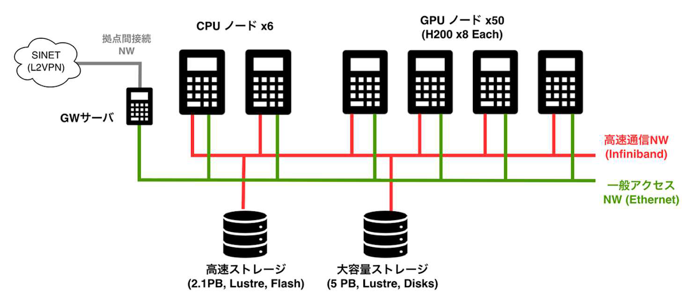

# 大規模GPUシステム SYNKA 公式サイト

## SYNKA システムについて

SYNKA システムは東京大学臨床医療システムAI研究推進機構および東京大学生産技術研究所の GPU クラスタで、東京大学情報基盤センターとともに運用にあたっています。NVIDIA H200 GPU を搭載した計算ノード 50 台（GPU 400 基）を備え、AI 学習・推論やデータ解析など、AI for Science に資する研究を目的として利用できます。

### システムの特徴

- NVIDIA H200 GPU を搭載した計算ノード 50 台（GPU 400 基）
- プロジェクト専有パーティションと共有パーティションの併設
- 階層型ストレージ（高速 SSD 2.1 PB ＋ 大容量 HDD 5 PB）を全ノードで共有
- Slurm によるジョブスケジューリング
- 標準ソフトウェア: CUDA / cuDNN / NCCL、コンテナ（Apptainer）、PyTorch / TensorFlow 等
  

---

## システム仕様

### 計算資源

| 項目 | 仕様 |
|------|------|
| GPU ノード | 50 台 |
| GPU | NVIDIA H200 × 8 基 / ノード（計 400 基） |
| CPU ノード | 6 台、Intel Xeon Platinum 8480+ × 2（56 コア） |
| メモリ | 2,048 GB / ノード |
| ローカルストレージ | 480 GB NVMe SSD × 2 / ノード |
| ノード間ネットワーク | InfiniBand NDR × 8 ポート / ノード |

### ソフトウェア

| 項目 | 内容 |
|------|------|
| OS | Ubuntu Server 22.04 |
| ジョブスケジューラ | Slurm |
| GPU ソフトウェア | CUDA / cuDNN / NCCL |
| コンテナ | Apptainer |
| 機械学習フレームワーク | PyTorch / TensorFlow / JAX |

---

## ストレージ

| 種別 | 容量 | 用途 | 備考 |
|------|------|------|------|
| 高速ストレージ（SSD） | 2.1 PB | 個人ディレクトリ専用（`/home`） | 容量の追加購入は不可（1 ユーザあたり 100 GB） |
| 大容量ストレージ | 5 PB | プロジェクト用ディレクトリ（`/data`） | 有料（5 TB まで無料、超過分は 540 円／TB／月）。詳細は[利用料金](#利用料金)を参照 |

---

## サービス

SYNKA では Slurm バッチキューによるジョブ管理を採用しており、計算資源を **専有パーティション** と **共有パーティション** の 2 種類に分けて運用しています。プロジェクトの規模・用途に応じて選択でき、**両方を併用することも可能** です。料金の詳細は[利用料金](#利用料金)セクションに集約しています。

### 専有パーティションの利用

専有パーティションは、ノード単位でプロジェクトに排他的に割り当てる利用形態です。大規模・長時間のジョブを継続的に流したい場合に適しています。

| 項目 | 内容 |
|------|------|
| ノード数 | 契約ノード数単位（1 ノード = 8 GPU）、複数ノードの申込可 |
| 利用単位 | 1 ノード／日（日割り計算） |
| 利用期間 | 1 カ月単位で設定（原則として年度末までの範囲内） |
| 最大実行時間 | 実質なし（契約期間中は継続確保） |
| 利用料金 | [利用料金](#利用料金)を参照 |
| 備考 | 契約期間中、専用ノードを確保。共有パーティションとの併用可 |

### 共有パーティションの利用

共有パーティションは、**GPU 利用時間** を購入することで複数プロジェクトが GPU を共有して利用する形態です。専有ノードを 1 台確保する必要がないため、小規模な利用にも適しています。

共有パーティションは空きがある場合に利用可能です。空きがない場合は待機キューに入り、空き発生後に実行されます（即時実行は保証されません）。

主として小規模な利用を想定した設計ですが、大規模な利用も可能です（共有全体の最大占有率には上限があります。詳細は運用手引きを参照）。

| 項目 | 内容 |
|------|------|
| ノード数 | 共有プールから自動割当（ジョブ単位でのノード固定は不要） |
| 利用単位 | 1 GPU 利用時間（= GPU 1 基 × 1 時間） |
| 最大実行時間 | 1 ジョブあたり 24 時間 |
| 利用料金 | [利用料金](#利用料金)を参照 |
| 備考 | 購入単位は 1,000 GPU 利用時間から。Slurm キューに投入し、空き GPU に自動配置 |

#### 超過利用（Overdraw）

SYNKA では、購入した GPU 利用時間を使い切った後も、**購入した GPU 利用時間の 20%** を超過枠として、引き続きジョブを投入できます（**超過利用**）。超過利用中のジョブは **低い優先度** で実行されます。

- **通常利用**（GPU 利用時間の残高あり）: 通常の優先度でジョブが実行されます
- **超過利用**（残高を超過、超過枠の範囲内）: 低い優先度で実行されます。通常利用のジョブ（GPU時間保有あり）が投入された場合、超過利用中のジョブは**直ちにキャンセル**されます（猶予時間はありません）
- **超過枠を超えた場合**: ジョブの投入が拒否されます。引き続き利用するには GPU 利用時間の追加購入が必要です

!!! note "ご注意"
    超過利用中のジョブは、**GPU利用時間の残高がある他プロジェクトのジョブに割り込まれ中断されることがあります**。超過利用はジョブの完了を保証するものではありません。

!!! warning "チェックポイント保存を推奨します"
    超過利用中のジョブはキャンセルされる可能性があります。定期的にチェックポイントを保存し、ジョブがキャンセルされた後にそのチェックポイントを読み込んで再開する機構を実装することを推奨します。

---

## 利用料金

すべての料金は **税込表記** です。

| 項目 | 単位 | 料金（税込） |
|------|------|---:|
| **共有パーティション** | 1 GPU 利用時間（= GPU 1 基 × 1 時間） | **172 円** |
| **専有パーティション** | 1 ノード（= 8 GPU）／ 日 | **33,000 円** |
| **大容量ストレージ** | 1 TB ／ 月 | **540 円**（5 TB まで無料） |

- 上記の利用料金額は総額表示です。利用料金に関する詳細は [**利用料金表（PDF）**](onepager-assets/images/SYNKA_pricelist.pdf)（[利用規程](https://drive.google.com/file/d/1gP57TTbfWYQ7vZSKATl86oWcBT_hWAZB/view) 第 11 条）をご確認ください
- **ストレージは大容量（HDD）のプロジェクト用ディレクトリ (`/data`) のみ有料** です（5 TB まで無料）。高速ストレージ（SSD）はユーザディレクトリ（`/home`）専用となり容量の追加購入は不可です
  
- ストレージは年度内いつでも申請可能です（翌月から反映。運用上の目安として前月 7 日までの申請を推奨）
  
- 共有パーティションの購入単位は **1,000 GPU 利用時間（172,000 円）** から。追加購入は**提供する計算資源に余裕がある場合のみ**可能です（利用料金表 脚注 *2）
  - 2⽉中旬以降は新規のGPU時間を購入いただけません
  
- 年度末（3 月 31 日）時点で未使用の GPU 利用時間は**次年度への繰り越しや返金はできません**（利用料金表 脚注 *1）
  
- 支払方法: **部局間振替**（東大内）または **請求書払い**（銀行振込）

---

## 利用規程・ポリシー

SYNKA システムの利用にあたっては、以下の規程・ポリシーを遵守してください。プロジェクト申請前に必ずお読みください。

- **[利用規程（PDF）](https://drive.google.com/file/d/1gP57TTbfWYQ7vZSKATl86oWcBT_hWAZB/view):** 利用条件、禁止事項、免責事項、利用料金等に関する規程
- **[個人情報保護方針（PDF）](https://drive.google.com/file/d/1T20s-t-3tNWDr8Ylgzt_KiSAjeaAhO7B/view):** 個人情報およびシステム運用データの取り扱い
- **[利用ガイド（PDF）](https://drive.google.com/file/d/1uFmiM_8LkCNguK1BKwgsFJ4i-J51gO8-/view):** ログイン方法、ジョブの投入、GPU 時間の残高確認など
- **[利用料金表（PDF）](onepager-assets/images/SYNKA_pricelist.pdf):** 利用料金・購入単位・支払方法の詳細

### 主なポリシー

- **利用目的:** 学術研究、教育及び社会貢献に供することを目的とします（第 3 条）
- **アカウント管理:** ユーザ ID の第三者への貸与・共有、権限の不正取得、無許可の鍵登録は一切禁止されています。SSH 公開鍵認証（ed25519 形式）のみをサポートしています（第 6 条）
- **データ管理:** バックアップは利用者の責任で実施してください。運営機関はデータ消失に関する責任を負いません（第 8 条）
- **成果公表:** 本システムの利用により得られた成果を公表する際は、SYNKA システム利用の旨を明記してください（第 10 条）
- **輸出管理:** 非居住者の利用や研究成果の海外移転には、輸出管理関連法令に基づく確認・手続きが必要な場合があります（第 21 条）

---

## 利用申込

### 利用資格

以下のいずれかに該当する方が申請できます。

1. 大学・高等専門学校・大学共同利用機関の教職員および学生
2. 学術研究・教育を目的とする公的機関に所属し研究に従事する方
3. 科学研究費助成事業等の公的資金を財源に学術研究を目的とする方
4. 民間企業に所属する方(別途審査あり)
5. その他、機関長が認めた方

### 申請の流れ

1. **利用規程・個人情報保護方針の確認**
   利用規程および個人情報保護方針をお読みいただき、同意の上で申請してください。

2. **プロジェクト申請フォームの作成**
   [所定の申請フォーム（Excel）](https://docs.google.com/spreadsheets/d/1zWkV_cqDvvFwrEKWdkRY2pQqsi-tZcaD/edit?usp=sharing) に、以下の必要事項を記入してください。

    - プロジェクトの目的と概要
    - 利用期間（1 ヶ月単位）
    - 申請計算資源（専有パーティションノード数、共有パーティション GPU 時間、ストレージ容量等: ご希望に沿えない場合があります）
    - プロジェクト代表者情報（所属、役職、メールアドレス等）
    - 利用料支払情報（支払担当者）
    - 利用者情報（所属、メールアドレス、SSH 公開鍵等）

3. **メールで提出**
   SYNKA 問い合わせ窓口 `contact [at] synka-jp.org` 宛に送付してください。メール以外の手段では申請を受け付けていません。

4. **審査**
   毎月 7 日までに受理された申請を当月 20 日までに審査し、結果を通知します。

5. **利用開始**
   承認後、翌月 1 日から利用開始です。アカウント情報を記載した「利用登録のお知らせ」をお送りします。

---

## サポート

### よくある質問（FAQ）

???+ question "Q. 学生でも利用できますか？"
    はい。大学・高専の学生は利用資格があります。プロジェクト代表者は原則として教職員です。

???+ question "Q. 民間企業からの利用は可能ですか？"
    はい。別途審査の上、承認する場合があります。

???+ question "Q. GPU 利用時間を使い切った後もジョブは実行できますか？"
    はい。超過利用（Overdraw）制度により、購入した GPU 利用時間の 20% を超過枠として、低い優先度で引き続きジョブを実行できます。ただし、GPU 利用時間の残高がある他プロジェクトのジョブに割り込まれ、中断されることがあります。超過枠を超えた場合はジョブの投入が拒否されますので、GPU 利用時間の追加購入をご検討ください。

???+ question "Q. 購入した GPU 利用時間は年度をまたいで繰り越せますか？"
    いいえ。年度末（3 月 31 日）に未使用の GPU 利用時間は失効します。返金・繰越はできません。

???+ question "Q. 障害でジョブが失敗した場合、GPU 利用時間は返却されますか？"
    システム障害が原因の場合は消費された GPU 利用時間を返却することがあります。ユーザ起因の失敗は返却対象外です。

???+ question "Q. ストレージ容量を増やしたいです"
    問い合わせ先メールアドレスにプロジェクト変更申請を行ってください。翌月から反映されます（運用上の目安として、前月 7 日までのお申し込みを推奨します）。年度内の減量申請は認めていません。

???+ question "Q. データのバックアップはありますか？"
    いいえ。バックアップは利用者の責任で実施してください。運営機関はデータ消失に関する責任を負いません。

### お問い合わせ

**SYNKA 問い合わせ窓口　東京大学情報基盤センター:** `contact [at] synka-jp.org`

FAQ および利用ガイドをお読みいただいても不明な点がある場合、システムの不具合やセキュリティインシデントが発生した場合は、上記メールアドレスにご連絡ください。メール以外の手段による連絡は受け付けておりません。

---
